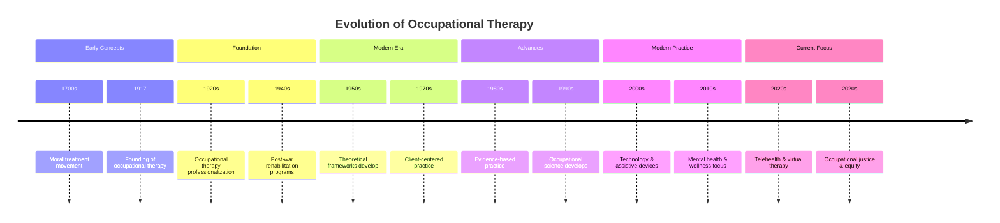

```mermaid
timeline
    title Evolution of Occupational Therapy
    section Early Concepts
        1700s : Moral treatment movement
        1917 : Founding of occupational therapy
    section Foundation
        1920s : Occupational therapy professionalization
        1940s : Post-war rehabilitation programs
    section Modern Era
        1950s : Theoretical frameworks develop
        1970s : Client-centered practice
    section Advances
        1980s : Evidence-based practice
        1990s : Occupational science develops
    section Modern Practice
        2000s : Technology & assistive devices
        2010s : Mental health & wellness focus
    section Current Focus
        2020s : Telehealth & virtual therapy
        2020s : Occupational justice & equity
```
