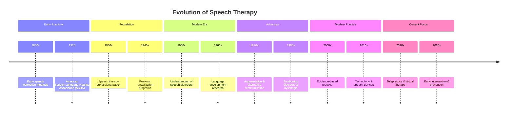

```mermaid
timeline
    title Evolution of Speech Therapy
    section Early Practices
        1800s : Early speech correction methods
        1925 : American Speech-Language-Hearing Association (ASHA)
    section Foundation
        1930s : Speech therapy professionalization
        1940s : Post-war rehabilitation programs
    section Modern Era
        1950s : Understanding of speech disorders
        1960s : Language development research
    section Advances
        1970s : Augmentative & alternative communication
        1980s : Swallowing disorders & dysphagia
    section Modern Practice
        2000s : Evidence-based practice
        2010s : Technology & speech devices
    section Current Focus
        2020s : Telepractice & virtual therapy
        2020s : Early intervention & prevention
```
