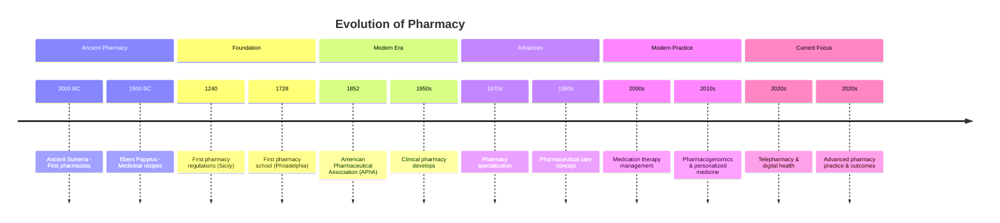

```mermaid
timeline
    title Evolution of Pharmacy
    section Ancient Pharmacy
        3000 BC : Ancient Sumeria - First pharmacists
        1500 BC : Ebers Papyrus - Medicinal recipes
    section Foundation
        1240 : First pharmacy regulations (Sicily)
        1728 : First pharmacy school (Philadelphia)
    section Modern Era
        1852 : American Pharmaceutical Association (APhA)
        1950s : Clinical pharmacy develops
    section Advances
        1970s : Pharmacy specialization
        1980s : Pharmaceutical care concept
    section Modern Practice
        2000s : Medication therapy management
        2010s : Pharmacogenomics & personalized medicine
    section Current Focus
        2020s : Telepharmacy & digital health
        2020s : Advanced pharmacy practice & outcomes
```
