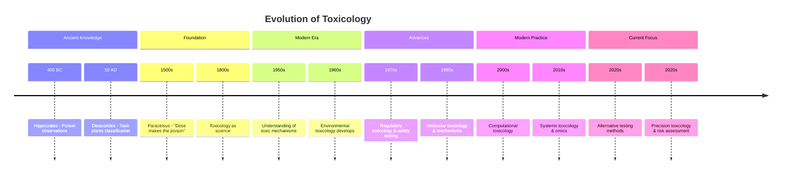

```mermaid
timeline
    title Evolution of Toxicology
    section Ancient Knowledge
        400 BC : Hippocrates - Poison observations
        50 AD : Dioscorides - Toxic plants classification
    section Foundation
        1500s : Paracelsus - "Dose makes the poison"
        1800s : Toxicology as science
    section Modern Era
        1950s : Understanding of toxic mechanisms
        1960s : Environmental toxicology develops
    section Advances
        1970s : Regulatory toxicology & safety testing
        1980s : Molecular toxicology & mechanisms
    section Modern Practice
        2000s : Computational toxicology
        2010s : Systems toxicology & omics
    section Current Focus
        2020s : Alternative testing methods
        2020s : Precision toxicology & risk assessment
```
