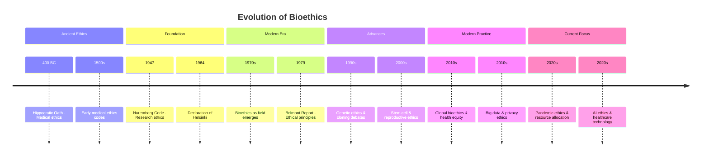

```mermaid
timeline
    title Evolution of Bioethics
    section Ancient Ethics
        400 BC : Hippocratic Oath - Medical ethics
        1500s : Early medical ethics codes
    section Foundation
        1947 : Nuremberg Code - Research ethics
        1964 : Declaration of Helsinki
    section Modern Era
        1970s : Bioethics as field emerges
        1979 : Belmont Report - Ethical principles
    section Advances
        1990s : Genetic ethics & cloning debates
        2000s : Stem cell & reproductive ethics
    section Modern Practice
        2010s : Global bioethics & health equity
        2010s : Big data & privacy ethics
    section Current Focus
        2020s : Pandemic ethics & resource allocation
        2020s : AI ethics & healthcare technology
```
