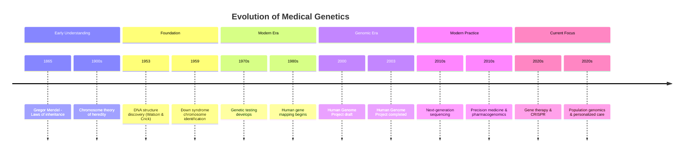

```mermaid
timeline
    title Evolution of Medical Genetics
    section Early Understanding
        1865 : Gregor Mendel - Laws of inheritance
        1900s : Chromosome theory of heredity
    section Foundation
        1953 : DNA structure discovery (Watson & Crick)
        1959 : Down syndrome chromosome identification
    section Modern Era
        1970s : Genetic testing develops
        1980s : Human gene mapping begins
    section Genomic Era
        2000 : Human Genome Project draft
        2003 : Human Genome Project completed
    section Modern Practice
        2010s : Next-generation sequencing
        2010s : Precision medicine & pharmacogenomics
    section Current Focus
        2020s : Gene therapy & CRISPR
        2020s : Population genomics & personalized care
```
