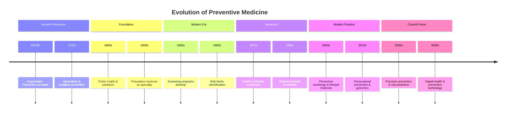

```mermaid
timeline
    title Evolution of Preventive Medicine
    section Ancient Prevention
        400 BC : Hippocrates - Prevention concepts
        1700s : Vaccination & smallpox prevention
    section Foundation
        1800s : Public health & sanitation
        1900s : Preventive medicine as specialty
    section Modern Era
        1950s : Screening programs develop
        1960s : Risk factor identification
    section Advances
        1970s : Health promotion movement
        1980s : Evidence-based prevention
    section Modern Practice
        2000s : Preventive cardiology & lifestyle medicine
        2010s : Personalized prevention & genomics
    section Current Focus
        2020s : Precision prevention & risk prediction
        2020s : Digital health & preventive technology
```
