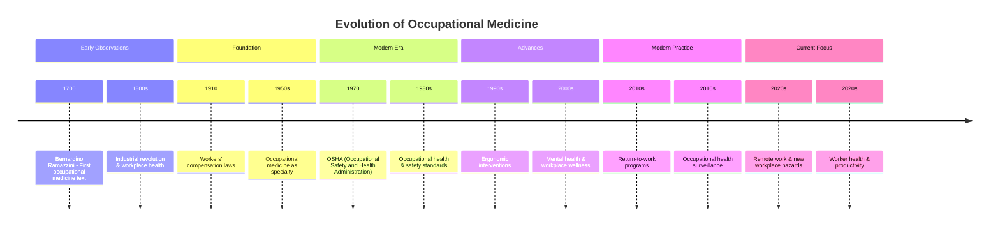

```mermaid
timeline
    title Evolution of Occupational Medicine
    section Early Observations
        1700 : Bernardino Ramazzini - First occupational medicine text
        1800s : Industrial revolution & workplace health
    section Foundation
        1910 : Workers' compensation laws
        1950s : Occupational medicine as specialty
    section Modern Era
        1970 : OSHA (Occupational Safety and Health Administration)
        1980s : Occupational health & safety standards
    section Advances
        1990s : Ergonomic interventions
        2000s : Mental health & workplace wellness
    section Modern Practice
        2010s : Return-to-work programs
        2010s : Occupational health surveillance
    section Current Focus
        2020s : Remote work & new workplace hazards
        2020s : Worker health & productivity
```
