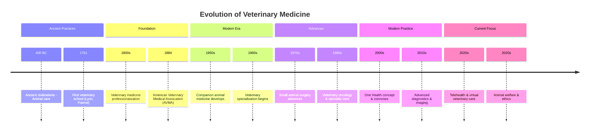

```mermaid
timeline
    title Evolution of Veterinary Medicine
    section Ancient Practices
        400 BC : Ancient civilizations - Animal care
        1761 : First veterinary school (Lyon, France)
    section Foundation
        1800s : Veterinary medicine professionalization
        1884 : American Veterinary Medical Association (AVMA)
    section Modern Era
        1950s : Companion animal medicine develops
        1960s : Veterinary specialization begins
    section Advances
        1970s : Small animal surgery advances
        1980s : Veterinary oncology & specialty care
    section Modern Practice
        2000s : One Health concept & zoonoses
        2010s : Advanced diagnostics & imaging
    section Current Focus
        2020s : Telehealth & virtual veterinary care
        2020s : Animal welfare & ethics
```
