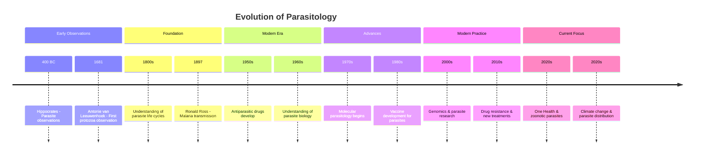

```mermaid
timeline
    title Evolution of Parasitology
    section Early Observations
        400 BC : Hippocrates - Parasite observations
        1681 : Antonie van Leeuwenhoek - First protozoa observation
    section Foundation
        1800s : Understanding of parasite life cycles
        1897 : Ronald Ross - Malaria transmission
    section Modern Era
        1950s : Antiparasitic drugs develop
        1960s : Understanding of parasite biology
    section Advances
        1970s : Molecular parasitology begins
        1980s : Vaccine development for parasites
    section Modern Practice
        2000s : Genomics & parasite research
        2010s : Drug resistance & new treatments
    section Current Focus
        2020s : One Health & zoonotic parasites
        2020s : Climate change & parasite distribution
```
