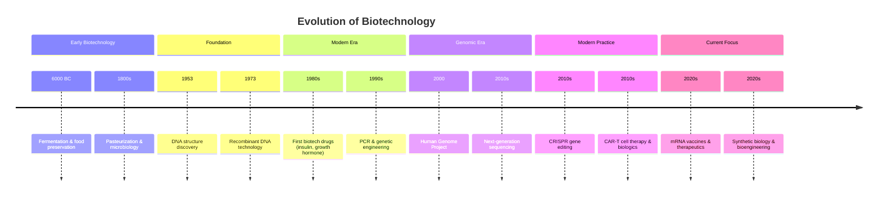

```mermaid
timeline
    title Evolution of Biotechnology
    section Early Biotechnology
        6000 BC : Fermentation & food preservation
        1800s : Pasteurization & microbiology
    section Foundation
        1953 : DNA structure discovery
        1973 : Recombinant DNA technology
    section Modern Era
        1980s : First biotech drugs (insulin, growth hormone)
        1990s : PCR & genetic engineering
    section Genomic Era
        2000 : Human Genome Project
        2010s : Next-generation sequencing
    section Modern Practice
        2010s : CRISPR gene editing
        2010s : CAR-T cell therapy & biologics
    section Current Focus
        2020s : mRNA vaccines & therapeutics
        2020s : Synthetic biology & bioengineering
```
