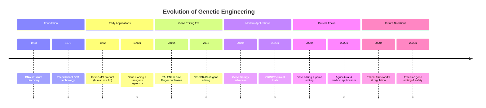

```mermaid
timeline
    title Evolution of Genetic Engineering
    section Foundation
        1953 : DNA structure discovery
        1973 : Recombinant DNA technology
    section Early Applications
        1982 : First GMO product (human insulin)
        1990s : Gene cloning & transgenic organisms
    section Gene Editing Era
        2010s : TALENs & Zinc Finger nucleases
        2012 : CRISPR-Cas9 gene editing
    section Modern Applications
        2010s : Gene therapy advances
        2020s : CRISPR clinical trials
    section Current Focus
        2020s : Base editing & prime editing
        2020s : Agricultural & medical applications
    section Future Directions
        2020s : Ethical frameworks & regulation
        2020s : Precision gene editing & safety
```
