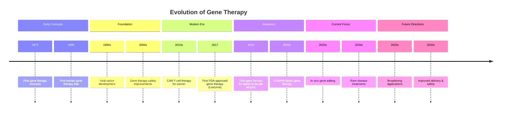

```mermaid
timeline
    title Evolution of Gene Therapy
    section Early Concepts
        1972 : First gene therapy concepts
        1990 : First human gene therapy trial
    section Foundation
        1990s : Viral vector development
        2000s : Gene therapy safety improvements
    section Modern Era
        2010s : CAR-T cell therapy for cancer
        2017 : First FDA-approved gene therapy (Luxturna)
    section Advances
        2019 : First gene therapy for spinal muscular atrophy
        2020s : CRISPR-based gene therapy
    section Current Focus
        2020s : In vivo gene editing
        2020s : Rare disease treatments
    section Future Directions
        2020s : Broadening applications
        2020s : Improved delivery & safety
```
