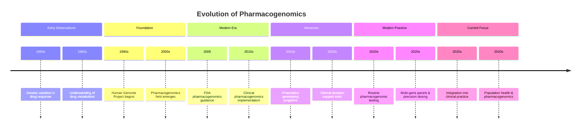

```mermaid
timeline
    title Evolution of Pharmacogenomics
    section Early Observations
        1950s : Genetic variation in drug response
        1960s : Understanding of drug metabolism
    section Foundation
        1990s : Human Genome Project begins
        2000s : Pharmacogenomics field emerges
    section Modern Era
        2005 : FDA pharmacogenomics guidance
        2010s : Clinical pharmacogenomics implementation
    section Advances
        2010s : Preemptive genotyping programs
        2020s : Clinical decision support tools
    section Modern Practice
        2020s : Routine pharmacogenomic testing
        2020s : Multi-gene panels & precision dosing
    section Current Focus
        2020s : Integration into clinical practice
        2020s : Population health & pharmacogenomics
```
