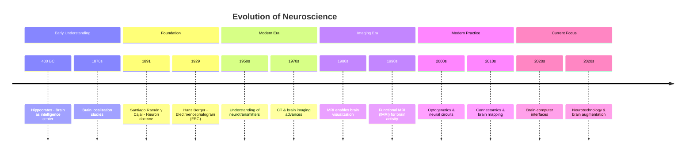

```mermaid
timeline
    title Evolution of Neuroscience
    section Early Understanding
        400 BC : Hippocrates - Brain as intelligence center
        1870s : Brain localization studies
    section Foundation
        1891 : Santiago Ramón y Cajal - Neuron doctrine
        1929 : Hans Berger - Electroencephalogram (EEG)
    section Modern Era
        1950s : Understanding of neurotransmitters
        1970s : CT & brain imaging advances
    section Imaging Era
        1980s : MRI enables brain visualization
        1990s : Functional MRI (fMRI) for brain activity
    section Modern Practice
        2000s : Optogenetics & neural circuits
        2010s : Connectomics & brain mapping
    section Current Focus
        2020s : Brain-computer interfaces
        2020s : Neurotechnology & brain augmentation
```
