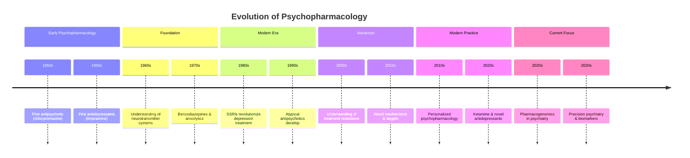

```mermaid
timeline
    title Evolution of Psychopharmacology
    section Early Psychopharmacology
        1950s : First antipsychotic (chlorpromazine)
        1950s : First antidepressants (imipramine)
    section Foundation
        1960s : Understanding of neurotransmitter systems
        1970s : Benzodiazepines & anxiolytics
    section Modern Era
        1980s : SSRIs revolutionize depression treatment
        1990s : Atypical antipsychotics develop
    section Advances
        2000s : Understanding of treatment resistance
        2010s : Novel mechanisms & targets
    section Modern Practice
        2010s : Personalized psychopharmacology
        2020s : Ketamine & novel antidepressants
    section Current Focus
        2020s : Pharmacogenomics in psychiatry
        2020s : Precision psychiatry & biomarkers
```
