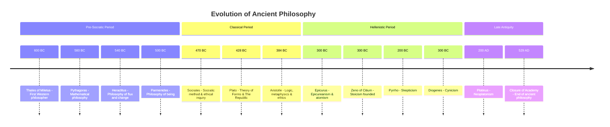

```mermaid
timeline
    title Evolution of Ancient Philosophy
    section Pre-Socratic Period
        600 BC : Thales of Miletus - First Western philosopher
        580 BC : Pythagoras - Mathematical philosophy
        540 BC : Heraclitus - Philosophy of flux and change
        500 BC : Parmenides - Philosophy of being
    section Classical Period
        470 BC : Socrates - Socratic method & ethical inquiry
        428 BC : Plato - Theory of Forms & The Republic
        384 BC : Aristotle - Logic, metaphysics & ethics
    section Hellenistic Period
        300 BC : Epicurus - Epicureanism & atomism
        300 BC : Zeno of Citium - Stoicism founded
        200 BC : Pyrrho - Skepticism
        300 BC : Diogenes - Cynicism
    section Late Antiquity
        200 AD : Plotinus - Neoplatonism
        529 AD : Closure of Academy - End of ancient philosophy
```
