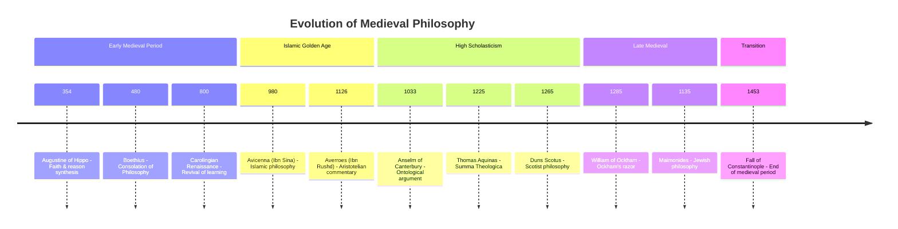

```mermaid
timeline
    title Evolution of Medieval Philosophy
    section Early Medieval Period
        354 : Augustine of Hippo - Faith & reason synthesis
        480 : Boethius - Consolation of Philosophy
        800 : Carolingian Renaissance - Revival of learning
    section Islamic Golden Age
        980 : Avicenna (Ibn Sina) - Islamic philosophy
        1126 : Averroes (Ibn Rushd) - Aristotelian commentary
    section High Scholasticism
        1033 : Anselm of Canterbury - Ontological argument
        1225 : Thomas Aquinas - Summa Theologica
        1265 : Duns Scotus - Scotist philosophy
    section Late Medieval
        1285 : William of Ockham - Ockham's razor
        1135 : Maimonides - Jewish philosophy
    section Transition
        1453 : Fall of Constantinople - End of medieval period
```
