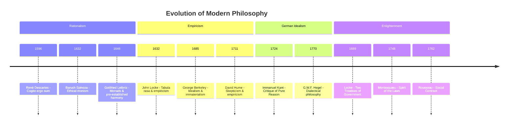

```mermaid
timeline
    title Evolution of Modern Philosophy
    section Rationalism
        1596 : René Descartes - Cogito ergo sum
        1632 : Baruch Spinoza - Ethical monism
        1646 : Gottfried Leibniz - Monads & pre-established harmony
    section Empiricism
        1632 : John Locke - Tabula rasa & empiricism
        1685 : George Berkeley - Idealism & immaterialism
        1711 : David Hume - Skepticism & empiricism
    section German Idealism
        1724 : Immanuel Kant - Critique of Pure Reason
        1770 : G.W.F. Hegel - Dialectical philosophy
    section Enlightenment
        1689 : Locke - Two Treatises of Government
        1748 : Montesquieu - Spirit of the Laws
        1762 : Rousseau - Social Contract
```
