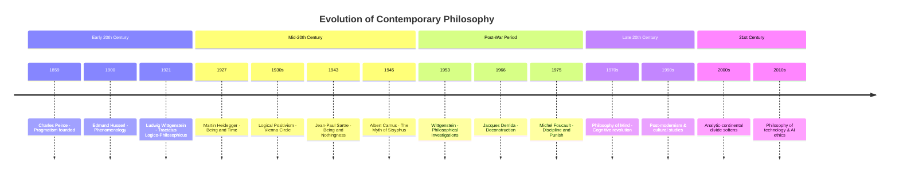

```mermaid
timeline
    title Evolution of Contemporary Philosophy
    section Early 20th Century
        1859 : Charles Peirce - Pragmatism founded
        1900 : Edmund Husserl - Phenomenology
        1921 : Ludwig Wittgenstein - Tractatus Logico-Philosophicus
    section Mid-20th Century
        1927 : Martin Heidegger - Being and Time
        1930s : Logical Positivism - Vienna Circle
        1943 : Jean-Paul Sartre - Being and Nothingness
        1945 : Albert Camus - The Myth of Sisyphus
    section Post-War Period
        1953 : Wittgenstein - Philosophical Investigations
        1966 : Jacques Derrida - Deconstruction
        1975 : Michel Foucault - Discipline and Punish
    section Late 20th Century
        1970s : Philosophy of Mind - Cognitive revolution
        1990s : Post-modernism & cultural studies
    section 21st Century
        2000s : Analytic-continental divide softens
        2010s : Philosophy of technology & AI ethics
```
