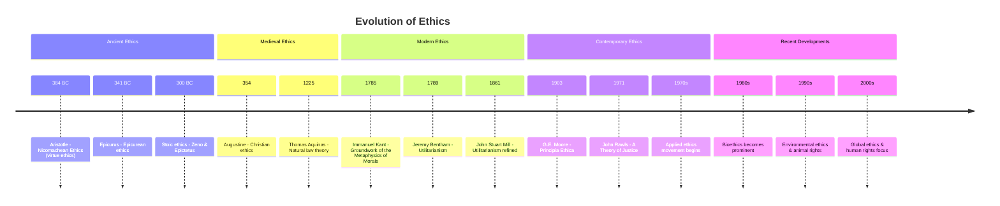

```mermaid
timeline
    title Evolution of Ethics
    section Ancient Ethics
        384 BC : Aristotle - Nicomachean Ethics (virtue ethics)
        341 BC : Epicurus - Epicurean ethics
        300 BC : Stoic ethics - Zeno & Epictetus
    section Medieval Ethics
        354 : Augustine - Christian ethics
        1225 : Thomas Aquinas - Natural law theory
    section Modern Ethics
        1785 : Immanuel Kant - Groundwork of the Metaphysics of Morals
        1789 : Jeremy Bentham - Utilitarianism
        1861 : John Stuart Mill - Utilitarianism refined
    section Contemporary Ethics
        1903 : G.E. Moore - Principia Ethica
        1971 : John Rawls - A Theory of Justice
        1970s : Applied ethics movement begins
    section Recent Developments
        1980s : Bioethics becomes prominent
        1990s : Environmental ethics & animal rights
        2000s : Global ethics & human rights focus
```
