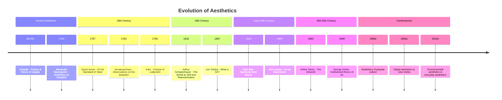

```mermaid
timeline
    title Evolution of Aesthetics
    section Ancient Aesthetics
        384 BC : Aristotle - Poetics & theory of tragedy
        1750 : Alexander Baumgarten - Aesthetics as discipline
    section 18th Century
        1757 : David Hume - Of the Standard of Taste
        1764 : Immanuel Kant - Observations on the Beautiful
        1790 : Kant - Critique of Judgment
    section 19th Century
        1818 : Arthur Schopenhauer - The World as Will and Representation
        1897 : Leo Tolstoy - What is Art?
    section Early 20th Century
        1913 : Clive Bell - Significant form theory
        1928 : John Dewey - Art as Experience
    section Mid-20th Century
        1964 : Arthur Danto - The Artworld
        1969 : George Dickie - Institutional theory of art
    section Contemporary
        1990s : Aesthetics of popular culture
        2000s : Digital aesthetics & new media
        2010s : Environmental aesthetics & everyday aesthetics
```
