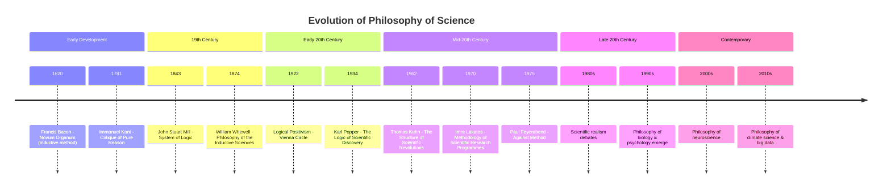

```mermaid
timeline
    title Evolution of Philosophy of Science
    section Early Development
        1620 : Francis Bacon - Novum Organum (inductive method)
        1781 : Immanuel Kant - Critique of Pure Reason
    section 19th Century
        1843 : John Stuart Mill - System of Logic
        1874 : William Whewell - Philosophy of the Inductive Sciences
    section Early 20th Century
        1922 : Logical Positivism - Vienna Circle
        1934 : Karl Popper - The Logic of Scientific Discovery
    section Mid-20th Century
        1962 : Thomas Kuhn - The Structure of Scientific Revolutions
        1970 : Imre Lakatos - Methodology of Scientific Research Programmes
        1975 : Paul Feyerabend - Against Method
    section Late 20th Century
        1980s : Scientific realism debates
        1990s : Philosophy of biology & psychology emerge
    section Contemporary
        2000s : Philosophy of neuroscience
        2010s : Philosophy of climate science & big data
```
