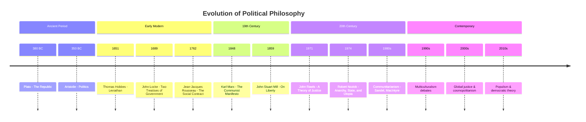

```mermaid
timeline
    title Evolution of Political Philosophy
    section Ancient Period
        380 BC : Plato - The Republic
        350 BC : Aristotle - Politics
    section Early Modern
        1651 : Thomas Hobbes - Leviathan
        1689 : John Locke - Two Treatises of Government
        1762 : Jean-Jacques Rousseau - The Social Contract
    section 19th Century
        1848 : Karl Marx - The Communist Manifesto
        1859 : John Stuart Mill - On Liberty
    section 20th Century
        1971 : John Rawls - A Theory of Justice
        1974 : Robert Nozick - Anarchy, State, and Utopia
        1980s : Communitarianism - Sandel, MacIntyre
    section Contemporary
        1990s : Multiculturalism debates
        2000s : Global justice & cosmopolitanism
        2010s : Populism & democratic theory
```
