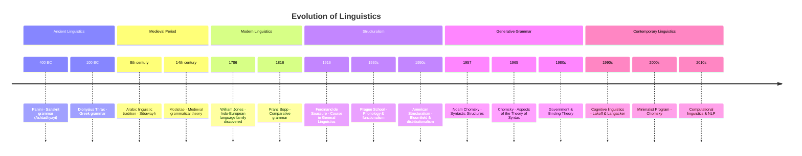

```mermaid
timeline
    title Evolution of Linguistics
    section Ancient Linguistics
        400 BC : Panini - Sanskrit grammar (Ashtadhyayi)
        100 BC : Dionysius Thrax - Greek grammar
    section Medieval Period
        8th century : Arabic linguistic tradition - Sibawayh
        14th century : Modistae - Medieval grammatical theory
    section Modern Linguistics
        1786 : William Jones - Indo-European language family discovered
        1816 : Franz Bopp - Comparative grammar
    section Structuralism
        1916 : Ferdinand de Saussure - Course in General Linguistics
        1930s : Prague School - Phonology & functionalism
        1950s : American Structuralism - Bloomfield & distributionalism
    section Generative Grammar
        1957 : Noam Chomsky - Syntactic Structures
        1965 : Chomsky - Aspects of the Theory of Syntax
        1980s : Government & Binding Theory
    section Contemporary Linguistics
        1990s : Cognitive linguistics - Lakoff & Langacker
        2000s : Minimalist Program - Chomsky
        2010s : Computational linguistics & NLP
```
