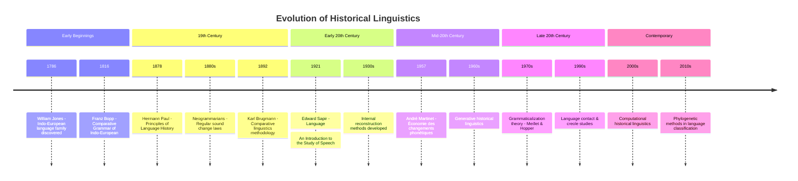

```mermaid
timeline
    title Evolution of Historical Linguistics
    section Early Beginnings
        1786 : William Jones - Indo-European language family discovered
        1816 : Franz Bopp - Comparative Grammar of Indo-European
    section 19th Century
        1878 : Hermann Paul - Principles of Language History
        1880s : Neogrammarians - Regular sound change laws
        1892 : Karl Brugmann - Comparative linguistics methodology
    section Early 20th Century
        1921 : Edward Sapir - Language: An Introduction to the Study of Speech
        1930s : Internal reconstruction methods developed
    section Mid-20th Century
        1957 : André Martinet - Économie des changements phonétiques
        1960s : Generative historical linguistics
    section Late 20th Century
        1970s : Grammaticalization theory - Meillet & Hopper
        1990s : Language contact & creole studies
    section Contemporary
        2000s : Computational historical linguistics
        2010s : Phylogenetic methods in language classification
```
