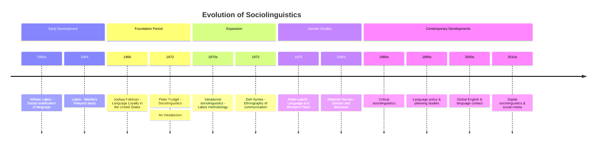

```mermaid
timeline
    title Evolution of Sociolinguistics
    section Early Development
        1960s : William Labov - Social stratification of language
        1964 : Labov - Martha's Vineyard study
    section Foundation Period
        1966 : Joshua Fishman - Language Loyalty in the United States
        1972 : Peter Trudgill - Sociolinguistics: An Introduction
    section Expansion
        1970s : Variationist sociolinguistics - Labov methodology
        1972 : Dell Hymes - Ethnography of communication
    section Gender Studies
        1975 : Robin Lakoff - Language and Woman's Place
        1990s : Deborah Tannen - Gender and discourse
    section Contemporary Developments
        1980s : Critical sociolinguistics
        1990s : Language policy & planning studies
        2000s : Global English & language contact
        2010s : Digital sociolinguistics & social media
```
