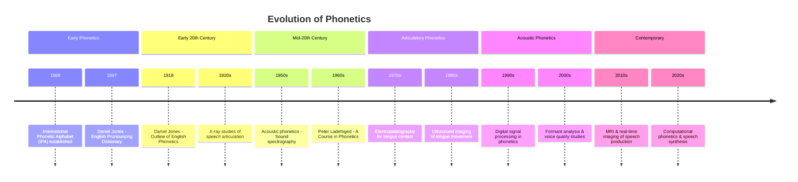

```mermaid
timeline
    title Evolution of Phonetics
    section Early Phonetics
        1888 : International Phonetic Alphabet (IPA) established
        1897 : Daniel Jones - English Pronouncing Dictionary
    section Early 20th Century
        1918 : Daniel Jones - Outline of English Phonetics
        1920s : X-ray studies of speech articulation
    section Mid-20th Century
        1950s : Acoustic phonetics - Sound spectrography
        1960s : Peter Ladefoged - A Course in Phonetics
    section Articulatory Phonetics
        1970s : Electropalatography for tongue contact
        1980s : Ultrasound imaging of tongue movement
    section Acoustic Phonetics
        1990s : Digital signal processing in phonetics
        2000s : Formant analysis & voice quality studies
    section Contemporary
        2010s : MRI & real-time imaging of speech production
        2020s : Computational phonetics & speech synthesis
```
