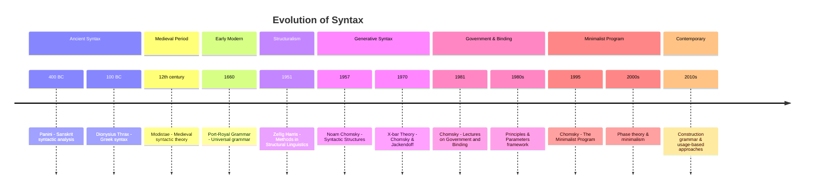

```mermaid
timeline
    title Evolution of Syntax
    section Ancient Syntax
        400 BC : Panini - Sanskrit syntactic analysis
        100 BC : Dionysius Thrax - Greek syntax
    section Medieval Period
        12th century : Modistae - Medieval syntactic theory
    section Early Modern
        1660 : Port-Royal Grammar - Universal grammar
    section Structuralism
        1951 : Zellig Harris - Methods in Structural Linguistics
    section Generative Syntax
        1957 : Noam Chomsky - Syntactic Structures
        1970 : X-bar Theory - Chomsky & Jackendoff
    section Government & Binding
        1981 : Chomsky - Lectures on Government and Binding
        1980s : Principles & Parameters framework
    section Minimalist Program
        1995 : Chomsky - The Minimalist Program
        2000s : Phase theory & minimalism
    section Contemporary
        2010s : Construction grammar & usage-based approaches
```
