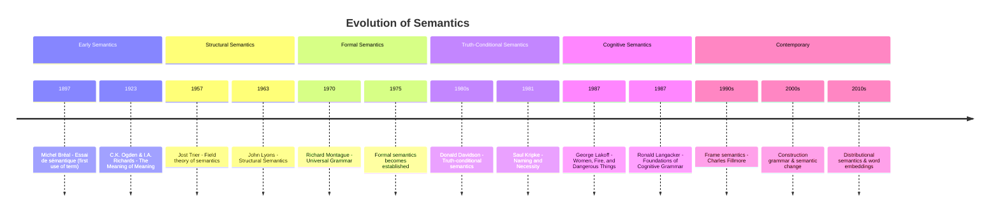

```mermaid
timeline
    title Evolution of Semantics
    section Early Semantics
        1897 : Michel Bréal - Essai de sémantique (first use of term)
        1923 : C.K. Ogden & I.A. Richards - The Meaning of Meaning
    section Structural Semantics
        1957 : Jost Trier - Field theory of semantics
        1963 : John Lyons - Structural Semantics
    section Formal Semantics
        1970 : Richard Montague - Universal Grammar
        1975 : Formal semantics becomes established
    section Truth-Conditional Semantics
        1980s : Donald Davidson - Truth-conditional semantics
        1981 : Saul Kripke - Naming and Necessity
    section Cognitive Semantics
        1987 : George Lakoff - Women, Fire, and Dangerous Things
        1987 : Ronald Langacker - Foundations of Cognitive Grammar
    section Contemporary
        1990s : Frame semantics - Charles Fillmore
        2000s : Construction grammar & semantic change
        2010s : Distributional semantics & word embeddings
```
