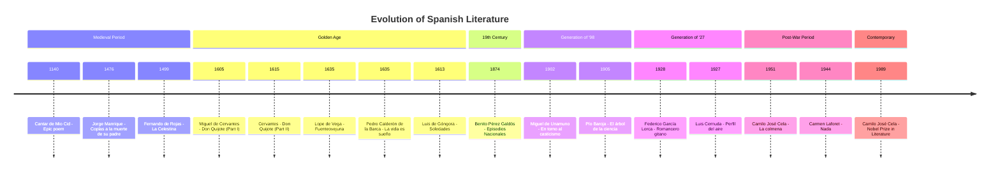

```mermaid
timeline
    title Evolution of Spanish Literature
    section Medieval Period
        1140 : Cantar de Mio Cid - Epic poem
        1476 : Jorge Manrique - Coplas a la muerte de su padre
        1499 : Fernando de Rojas - La Celestina
    section Golden Age
        1605 : Miguel de Cervantes - Don Quijote (Part I)
        1615 : Cervantes - Don Quijote (Part II)
        1635 : Lope de Vega - Fuenteovejuna
        1635 : Pedro Calderón de la Barca - La vida es sueño
        1613 : Luis de Góngora - Soledades
    section 19th Century
        1874 : Benito Pérez Galdós - Episodios Nacionales
    section Generation of '98
        1902 : Miguel de Unamuno - En torno al casticismo
        1905 : Pío Baroja - El árbol de la ciencia
    section Generation of '27
        1928 : Federico García Lorca - Romancero gitano
        1927 : Luis Cernuda - Perfil del aire
    section Post-War Period
        1951 : Camilo José Cela - La colmena
        1944 : Carmen Laforet - Nada
    section Contemporary
        1989 : Camilo José Cela - Nobel Prize in Literature
```
