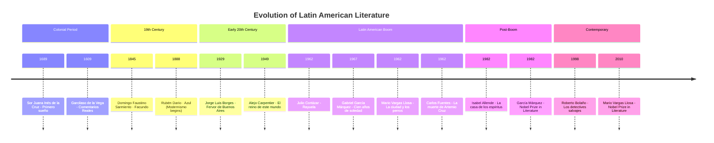

```mermaid
timeline
    title Evolution of Latin American Literature
    section Colonial Period
        1689 : Sor Juana Inés de la Cruz - Primero sueño
        1609 : Garcilaso de la Vega - Comentarios Reales
    section 19th Century
        1845 : Domingo Faustino Sarmiento - Facundo
        1888 : Rubén Darío - Azul (Modernismo begins)
    section Early 20th Century
        1929 : Jorge Luis Borges - Fervor de Buenos Aires
        1949 : Alejo Carpentier - El reino de este mundo
    section Latin American Boom
        1962 : Julio Cortázar - Rayuela
        1967 : Gabriel García Márquez - Cien años de soledad
        1962 : Mario Vargas Llosa - La ciudad y los perros
        1962 : Carlos Fuentes - La muerte de Artemio Cruz
    section Post-Boom
        1982 : Isabel Allende - La casa de los espíritus
        1982 : García Márquez - Nobel Prize in Literature
    section Contemporary
        1998 : Roberto Bolaño - Los detectives salvajes
        2010 : Mario Vargas Llosa - Nobel Prize in Literature
```
