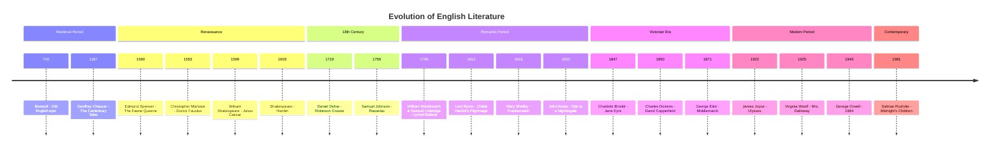

```mermaid
timeline
    title Evolution of English Literature
    section Medieval Period
        700 : Beowulf - Old English epic
        1387 : Geoffrey Chaucer - The Canterbury Tales
    section Renaissance
        1590 : Edmund Spenser - The Faerie Queene
        1593 : Christopher Marlowe - Doctor Faustus
        1599 : William Shakespeare - Julius Caesar
        1603 : Shakespeare - Hamlet
    section 18th Century
        1719 : Daniel Defoe - Robinson Crusoe
        1759 : Samuel Johnson - Rasselas
    section Romantic Period
        1798 : William Wordsworth & Samuel Coleridge - Lyrical Ballads
        1812 : Lord Byron - Childe Harold's Pilgrimage
        1818 : Mary Shelley - Frankenstein
        1820 : John Keats - Ode to a Nightingale
    section Victorian Era
        1847 : Charlotte Brontë - Jane Eyre
        1850 : Charles Dickens - David Copperfield
        1871 : George Eliot - Middlemarch
    section Modern Period
        1922 : James Joyce - Ulysses
        1925 : Virginia Woolf - Mrs. Dalloway
        1949 : George Orwell - 1984
    section Contemporary
        1981 : Salman Rushdie - Midnight's Children
```
