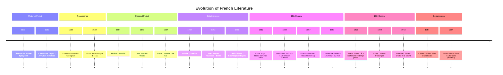

```mermaid
timeline
    title Evolution of French Literature
    section Medieval Period
        1100 : Chanson de Roland - Epic poem
        1180 : Chrétien de Troyes - Arthurian romances
    section Renaissance
        1532 : François Rabelais - Pantagruel
        1580 : Michel de Montaigne - Essais
    section Classical Period
        1664 : Molière - Tartuffe
        1677 : Jean Racine - Phèdre
        1637 : Pierre Corneille - Le Cid
    section Enlightenment
        1759 : Voltaire - Candide
        1762 : Jean-Jacques Rousseau - Émile
        1751 : Denis Diderot - Encyclopédie begins
    section 19th Century
        1831 : Victor Hugo - Notre-Dame de Paris
        1842 : Honoré de Balzac - La Comédie humaine
        1857 : Gustave Flaubert - Madame Bovary
        1857 : Charles Baudelaire - Les Fleurs du mal
    section 20th Century
        1913 : Marcel Proust - À la recherche du temps perdu
        1942 : Albert Camus - L'Étranger
        1943 : Jean-Paul Sartre - L'Être et le Néant
    section Contemporary
        1957 : Camus - Nobel Prize in Literature
        1964 : Sartre - Nobel Prize in Literature (declined)
```
