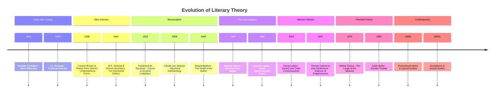

```mermaid
timeline
    title Evolution of Literary Theory
    section Early 20th Century
        1915 : Russian Formalism - Viktor Shklovsky
        1929 : I.A. Richards - Practical Criticism
    section New Criticism
        1938 : Cleanth Brooks & Robert Penn Warren - Understanding Poetry
        1947 : W.K. Wimsatt & Monroe Beardsley - The Intentional Fallacy
    section Structuralism
        1916 : Ferdinand de Saussure - Course in General Linguistics
        1958 : Claude Lévi-Strauss - Structural Anthropology
        1967 : Roland Barthes - The Death of the Author
    section Post-Structuralism
        1966 : Jacques Derrida - Deconstruction begins
        1966 : Jacques Lacan - Écrits (psychoanalytic theory)
    section Marxist Criticism
        1923 : Georg Lukács - History and Class Consciousness
        1947 : Theodor Adorno & Max Horkheimer - Dialectic of Enlightenment
    section Feminist Theory
        1975 : Hélène Cixous - The Laugh of the Medusa
        1990 : Judith Butler - Gender Trouble
    section Contemporary
        1990s : Postcolonial theory & cultural studies
        2000s : Ecocriticism & animal studies
```
