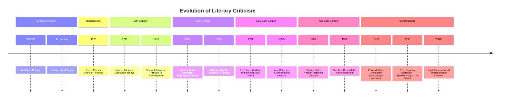

```mermaid
timeline
    title Evolution of Literary Criticism
    section Ancient Criticism
        335 BC : Aristotle - Poetics
        1st century : Horace - Ars Poetica
    section Renaissance
        1570 : Julius Caesar Scaliger - Poetics
    section 18th Century
        1711 : Joseph Addison - Spectator essays
        1759 : Samuel Johnson - Preface to Shakespeare
    section 19th Century
        1817 : Samuel Taylor Coleridge - Biographia Literaria
        1865 : Matthew Arnold - Essays in Criticism
    section Early 20th Century
        1924 : T.S. Eliot - Tradition and the Individual Talent
        1930s : New Criticism - Close reading methods
    section Mid-20th Century
        1967 : Stanley Fish - Reader-response criticism
        1980 : Stephen Greenblatt - New Historicism
    section Contemporary
        1978 : Edward Said - Orientalism (postcolonial criticism)
        1990 : Eve Kosofsky Sedgwick - Epistemology of the Closet
        2000s : Digital humanities & computational criticism
```
