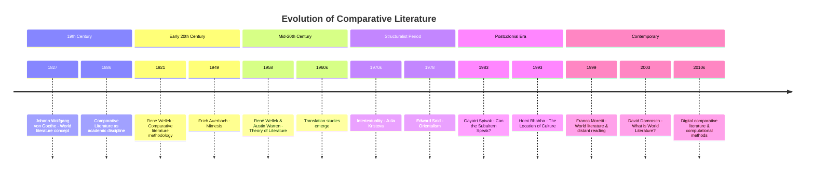

```mermaid
timeline
    title Evolution of Comparative Literature
    section 19th Century
        1827 : Johann Wolfgang von Goethe - World literature concept
        1886 : Comparative Literature as academic discipline
    section Early 20th Century
        1921 : René Wellek - Comparative literature methodology
        1949 : Erich Auerbach - Mimesis
    section Mid-20th Century
        1958 : René Wellek & Austin Warren - Theory of Literature
        1960s : Translation studies emerge
    section Structuralist Period
        1970s : Intertextuality - Julia Kristeva
        1978 : Edward Said - Orientalism
    section Postcolonial Era
        1983 : Gayatri Spivak - Can the Subaltern Speak?
        1993 : Homi Bhabha - The Location of Culture
    section Contemporary
        1999 : Franco Moretti - World literature & distant reading
        2003 : David Damrosch - What is World Literature?
        2010s : Digital comparative literature & computational methods
```
