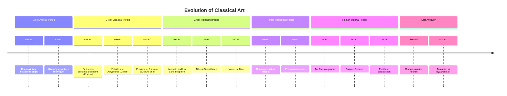

```mermaid
timeline
    title Evolution of Classical Art
    section Greek Archaic Period
        650 BC : Kouros & Kore sculptures begin
        600 BC : Black-figure pottery technique
    section Greek Classical Period
        447 BC : Parthenon construction begins (Phidias)
        450 BC : Polykleitos - Doryphoros (Canon)
        440 BC : Praxiteles - Classical sculpture peak
    section Greek Hellenistic Period
        200 BC : Laocoön and His Sons sculpture
        190 BC : Nike of Samothrace
        150 BC : Venus de Milo
    section Roman Republican Period
        100 BC : Roman portraiture realism
        50 BC : Pompeian frescoes
    section Roman Imperial Period
        13 BC : Ara Pacis Augustae
        113 AD : Trajan's Column
        125 AD : Pantheon construction
    section Late Antiquity
        300 AD : Roman mosaics flourish
        400 AD : Transition to Byzantine art
```
