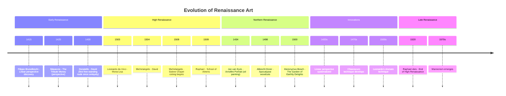

```mermaid
timeline
    title Evolution of Renaissance Art
    section Early Renaissance
        1415 : Filippo Brunelleschi - Linear perspective discovery
        1425 : Masaccio - The Tribute Money (perspective)
        1430 : Donatello - David (first free-standing nude since antiquity)
    section High Renaissance
        1503 : Leonardo da Vinci - Mona Lisa
        1504 : Michelangelo - David
        1508 : Michelangelo - Sistine Chapel ceiling begins
        1509 : Raphael - School of Athens
    section Northern Renaissance
        1434 : Jan van Eyck - Arnolfini Portrait (oil painting)
        1498 : Albrecht Dürer - Apocalypse woodcuts
        1500 : Hieronymus Bosch - The Garden of Earthly Delights
    section Innovations
        1420s : Linear perspective systematized
        1470s : Chiaroscuro technique develops
        1500s : Leonardo's sfumato technique
    section Late Renaissance
        1520 : Raphael dies - End of High Renaissance
        1570s : Mannerism emerges
```
