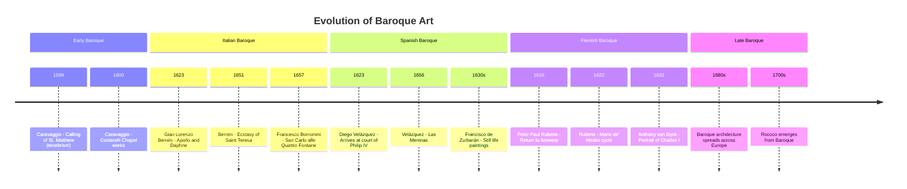

```mermaid
timeline
    title Evolution of Baroque Art
    section Early Baroque
        1599 : Caravaggio - Calling of St. Matthew (tenebrism)
        1600 : Caravaggio - Contarelli Chapel works
    section Italian Baroque
        1623 : Gian Lorenzo Bernini - Apollo and Daphne
        1651 : Bernini - Ecstasy of Saint Teresa
        1657 : Francesco Borromini - San Carlo alle Quattro Fontane
    section Spanish Baroque
        1623 : Diego Velázquez - Arrives at court of Philip IV
        1656 : Velázquez - Las Meninas
        1630s : Francisco de Zurbarán - Still life paintings
    section Flemish Baroque
        1610 : Peter Paul Rubens - Return to Antwerp
        1622 : Rubens - Marie de' Medici cycle
        1632 : Anthony van Dyck - Portrait of Charles I
    section Late Baroque
        1680s : Baroque architecture spreads across Europe
        1700s : Rococo emerges from Baroque
```
