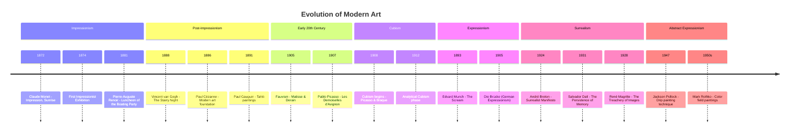

```mermaid
timeline
    title Evolution of Modern Art
    section Impressionism
        1872 : Claude Monet - Impression, Sunrise
        1874 : First Impressionist Exhibition
        1881 : Pierre-Auguste Renoir - Luncheon of the Boating Party
    section Post-Impressionism
        1888 : Vincent van Gogh - The Starry Night
        1886 : Paul Cézanne - Modern art foundation
        1891 : Paul Gauguin - Tahiti paintings
    section Early 20th Century
        1905 : Fauvism - Matisse & Derain
        1907 : Pablo Picasso - Les Demoiselles d'Avignon
    section Cubism
        1908 : Cubism begins - Picasso & Braque
        1912 : Analytical Cubism phase
    section Expressionism
        1893 : Edvard Munch - The Scream
        1905 : Die Brücke (German Expressionism)
    section Surrealism
        1924 : André Breton - Surrealist Manifesto
        1931 : Salvador Dalí - The Persistence of Memory
        1928 : René Magritte - The Treachery of Images
    section Abstract Expressionism
        1947 : Jackson Pollock - Drip painting technique
        1950s : Mark Rothko - Color field paintings
```
