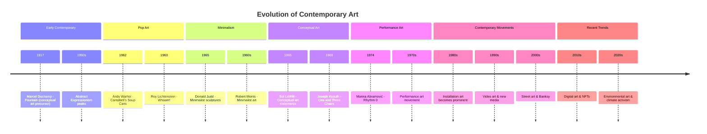

```mermaid
timeline
    title Evolution of Contemporary Art
    section Early Contemporary
        1917 : Marcel Duchamp - Fountain (conceptual art precursor)
        1950s : Abstract Expressionism peaks
    section Pop Art
        1962 : Andy Warhol - Campbell's Soup Cans
        1963 : Roy Lichtenstein - Whaam!
    section Minimalism
        1965 : Donald Judd - Minimalist sculptures
        1960s : Robert Morris - Minimalist art
    section Conceptual Art
        1965 : Sol LeWitt - Conceptual art statements
        1969 : Joseph Kosuth - One and Three Chairs
    section Performance Art
        1974 : Marina Abramović - Rhythm 0
        1970s : Performance art movement
    section Contemporary Movements
        1980s : Installation art becomes prominent
        1990s : Video art & new media
        2000s : Street art & Banksy
    section Recent Trends
        2010s : Digital art & NFTs
        2020s : Environmental art & climate activism
```
