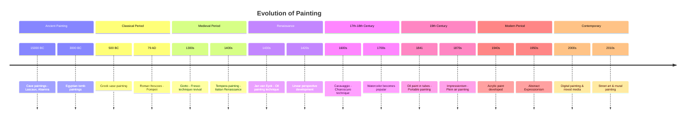

```mermaid
timeline
    title Evolution of Painting
    section Ancient Painting
        15000 BC : Cave paintings - Lascaux, Altamira
        3000 BC : Egyptian tomb paintings
    section Classical Period
        500 BC : Greek vase painting
        79 AD : Roman frescoes - Pompeii
    section Medieval Period
        1300s : Giotto - Fresco technique revival
        1400s : Tempera painting - Italian Renaissance
    section Renaissance
        1430s : Jan van Eyck - Oil painting technique
        1420s : Linear perspective development
    section 17th-18th Century
        1600s : Caravaggio - Chiaroscuro technique
        1700s : Watercolor becomes popular
    section 19th Century
        1841 : Oil paint in tubes - Portable painting
        1870s : Impressionism - Plein air painting
    section Modern Period
        1940s : Acrylic paint developed
        1950s : Abstract Expressionism
    section Contemporary
        2000s : Digital painting & mixed media
        2010s : Street art & mural painting
```
