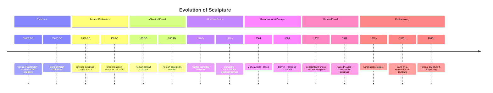

```mermaid
timeline
    title Evolution of Sculpture
    section Prehistoric
        30000 BC : Venus of Willendorf - Oldest known sculpture
        25000 BC : Cave art relief sculptures
    section Ancient Civilizations
        2500 BC : Egyptian sculpture - Great Sphinx
        450 BC : Greek Classical sculpture - Phidias
    section Classical Period
        100 BC : Roman portrait sculpture
        200 AD : Roman equestrian statues
    section Medieval Period
        1200s : Gothic cathedral sculpture
        1400s : Donatello - Renaissance sculpture revival
    section Renaissance & Baroque
        1504 : Michelangelo - David
        1623 : Bernini - Baroque sculpture
    section Modern Period
        1907 : Constantin Brancusi - Modern sculpture
        1912 : Pablo Picasso - Constructed sculpture
    section Contemporary
        1960s : Minimalist sculpture
        1970s : Land art & environmental sculpture
        2000s : Digital sculpture & 3D printing
```
