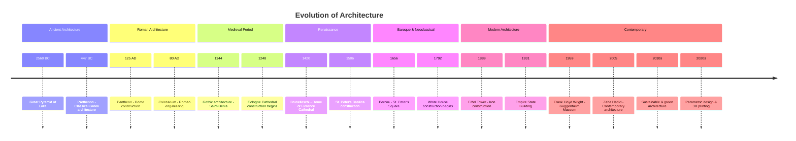

```mermaid
timeline
    title Evolution of Architecture
    section Ancient Architecture
        2560 BC : Great Pyramid of Giza
        447 BC : Parthenon - Classical Greek architecture
    section Roman Architecture
        125 AD : Pantheon - Dome construction
        80 AD : Colosseum - Roman engineering
    section Medieval Period
        1144 : Gothic architecture - Saint-Denis
        1248 : Cologne Cathedral construction begins
    section Renaissance
        1420 : Brunelleschi - Dome of Florence Cathedral
        1506 : St. Peter's Basilica construction
    section Baroque & Neoclassical
        1656 : Bernini - St. Peter's Square
        1792 : White House construction begins
    section Modern Architecture
        1889 : Eiffel Tower - Iron construction
        1931 : Empire State Building
    section Contemporary
        1959 : Frank Lloyd Wright - Guggenheim Museum
        2005 : Zaha Hadid - Contemporary architecture
        2010s : Sustainable & green architecture
        2020s : Parametric design & 3D printing
```
