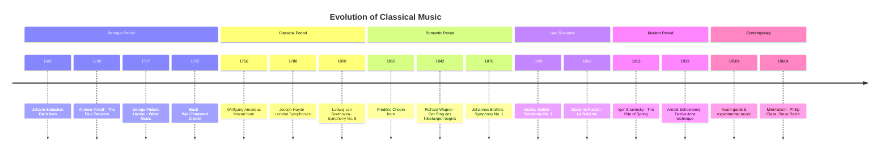

```mermaid
timeline
    title Evolution of Classical Music
    section Baroque Period
        1685 : Johann Sebastian Bach born
        1700 : Antonio Vivaldi - The Four Seasons
        1717 : George Frideric Handel - Water Music
        1722 : Bach - Well-Tempered Clavier
    section Classical Period
        1756 : Wolfgang Amadeus Mozart born
        1788 : Joseph Haydn - London Symphonies
        1808 : Ludwig van Beethoven - Symphony No. 5
    section Romantic Period
        1810 : Frédéric Chopin born
        1842 : Richard Wagner - Der Ring des Nibelungen begins
        1876 : Johannes Brahms - Symphony No. 1
    section Late Romantic
        1888 : Gustav Mahler - Symphony No. 1
        1896 : Giacomo Puccini - La Bohème
    section Modern Period
        1913 : Igor Stravinsky - The Rite of Spring
        1923 : Arnold Schoenberg - Twelve-tone technique
    section Contemporary
        1950s : Avant-garde & experimental music
        1960s : Minimalism - Philip Glass, Steve Reich
```
