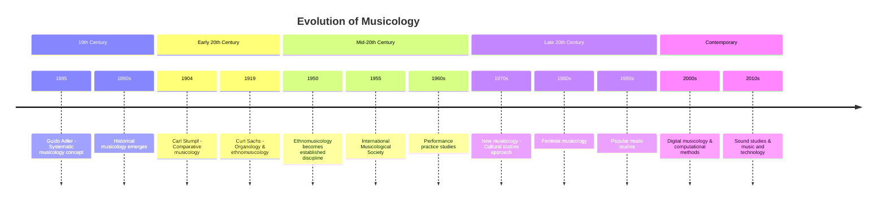

```mermaid
timeline
    title Evolution of Musicology
    section 19th Century
        1885 : Guido Adler - Systematic musicology concept
        1890s : Historical musicology emerges
    section Early 20th Century
        1904 : Carl Stumpf - Comparative musicology
        1919 : Curt Sachs - Organology & ethnomusicology
    section Mid-20th Century
        1950 : Ethnomusicology becomes established discipline
        1955 : International Musicological Society
        1960s : Performance practice studies
    section Late 20th Century
        1970s : New musicology - Cultural studies approach
        1980s : Feminist musicology
        1990s : Popular music studies
    section Contemporary
        2000s : Digital musicology & computational methods
        2010s : Sound studies & music and technology
```
