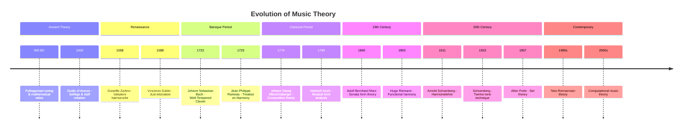

```mermaid
timeline
    title Evolution of Music Theory
    section Ancient Theory
        500 BC : Pythagorean tuning & mathematical ratios
        1000 : Guido of Arezzo - Solfège & staff notation
    section Renaissance
        1558 : Gioseffo Zarlino - Istitutioni harmoniche
        1588 : Vincenzo Galilei - Just intonation
    section Baroque Period
        1722 : Johann Sebastian Bach - Well-Tempered Clavier
        1725 : Jean-Philippe Rameau - Treatise on Harmony
    section Classical Period
        1776 : Johann Georg Albrechtsberger - Composition theory
        1789 : Heinrich Koch - Musical form analysis
    section 19th Century
        1840 : Adolf Bernhard Marx - Sonata form theory
        1893 : Hugo Riemann - Functional harmony
    section 20th Century
        1911 : Arnold Schoenberg - Harmonielehre
        1923 : Schoenberg - Twelve-tone technique
        1957 : Allen Forte - Set theory
    section Contemporary
        1980s : Neo-Riemannian theory
        2000s : Computational music theory
```
