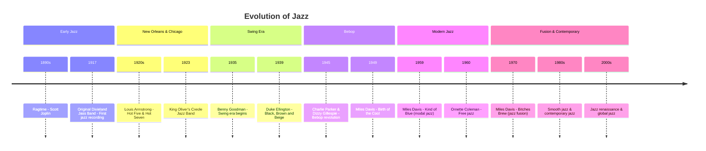

```mermaid
timeline
    title Evolution of Jazz
    section Early Jazz
        1890s : Ragtime - Scott Joplin
        1917 : Original Dixieland Jass Band - First jazz recording
    section New Orleans & Chicago
        1920s : Louis Armstrong - Hot Five & Hot Seven
        1923 : King Oliver's Creole Jazz Band
    section Swing Era
        1935 : Benny Goodman - Swing era begins
        1939 : Duke Ellington - Black, Brown and Beige
    section Bebop
        1945 : Charlie Parker & Dizzy Gillespie - Bebop revolution
        1949 : Miles Davis - Birth of the Cool
    section Modern Jazz
        1959 : Miles Davis - Kind of Blue (modal jazz)
        1960 : Ornette Coleman - Free jazz
    section Fusion & Contemporary
        1970 : Miles Davis - Bitches Brew (jazz fusion)
        1980s : Smooth jazz & contemporary jazz
        2000s : Jazz renaissance & global jazz
```
