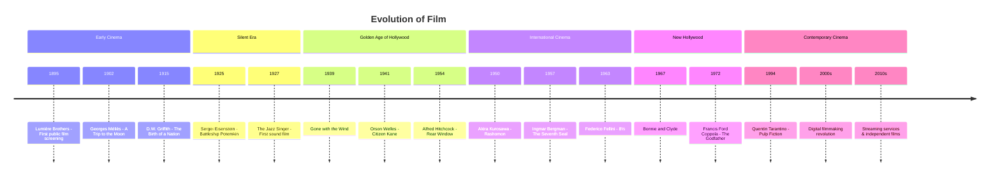

```mermaid
timeline
    title Evolution of Film
    section Early Cinema
        1895 : Lumière Brothers - First public film screening
        1902 : Georges Méliès - A Trip to the Moon
        1915 : D.W. Griffith - The Birth of a Nation
    section Silent Era
        1925 : Sergei Eisenstein - Battleship Potemkin
        1927 : The Jazz Singer - First sound film
    section Golden Age of Hollywood
        1939 : Gone with the Wind
        1941 : Orson Welles - Citizen Kane
        1954 : Alfred Hitchcock - Rear Window
    section International Cinema
        1950 : Akira Kurosawa - Rashomon
        1957 : Ingmar Bergman - The Seventh Seal
        1963 : Federico Fellini - 8½
    section New Hollywood
        1967 : Bonnie and Clyde
        1972 : Francis Ford Coppola - The Godfather
    section Contemporary Cinema
        1994 : Quentin Tarantino - Pulp Fiction
        2000s : Digital filmmaking revolution
        2010s : Streaming services & independent films
```
